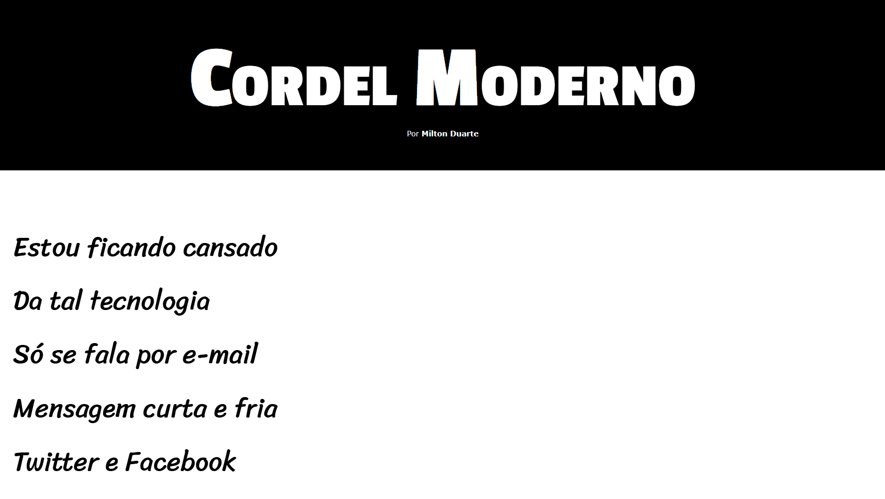
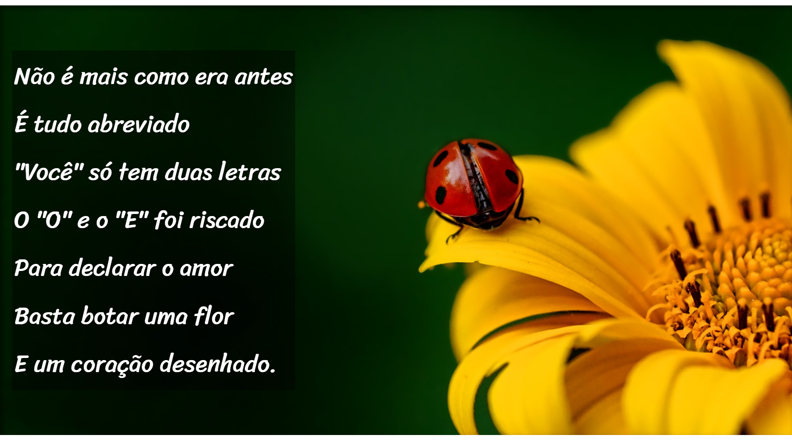

# 📜 Projeto Cordel Moderno

Este projeto é uma página web desenvolvida para apresentar o poema "Cordel Moderno", de autoria de Milton Duarte. O site propõe uma experiência de leitura fluida e imersiva, mesclando a literatura tradicional do cordel com técnicas modernas de design web.

Desenvolvido durante o Módulo 3 do curso de HTML5 e CSS3 do **Curso em Vídeo**, o projeto serviu como um laboratório prático para consolidar conceitos de estilização avançada e comportamento de imagens de fundo.

---

## 🚀 Tecnologias e Técnicas Aplicadas

O desenvolvimento foi focado no uso de **HTML5 e CSS3 puros**, com ênfase na semântica e na criação de efeitos visuais sem a necessidade de JavaScript. Os principais destaques técnicos incluem:

* **Efeito Parallax (CSS Puro):** Utilização da propriedade `background-attachment: fixed` nas seções de imagem (`.imagem`). Isso cria a ilusão de profundidade, onde o fundo permanece estático enquanto o texto rola pela tela.
* **Tipografia Customizada e Variáveis:** Gerenciamento de múltiplas fontes do Google Fonts (*Passion One*, *Sriracha*, *Verdana*) através de variáveis CSS (`--fonte1`, `--fonte2`, etc.) no seletor `:root`, garantindo um código limpo e de fácil manutenção.
* **Unidades de Medida Relativas (Viewport):** Uso de unidades como `vw` (Viewport Width) e `vh` (Viewport Height) para os tamanhos de fonte e espaçamentos (paddings). Isso garante que o texto e as seções se redimensionem proporcionalmente ao tamanho da tela do usuário.
* **Filtros e Sombreamentos:** Aplicação de `box-shadow: inset` para criar um sombreamento interno nas imagens de fundo, e `text-shadow` acompanhado de fundos translúcidos (`rgba`) para garantir a legibilidade dos versos sobre as fotografias.

---

## 📖 Como visualizar o projeto?

👉 [Clique aqui para acessar o Cordel Moderno](https://valdirneto34.github.io/Projeto-Cordel/)

---

## 🛠️ Como rodar localmente?

1. Clone este repositório para a sua máquina:
   ```bash
   git clone https://valdirneto34.github.io/Projeto-Cordel/
   ```

---

## 📖 Screenshots do Projeto
   <p align="center">
        
    </p>
   <p align="center">
        
    </p>